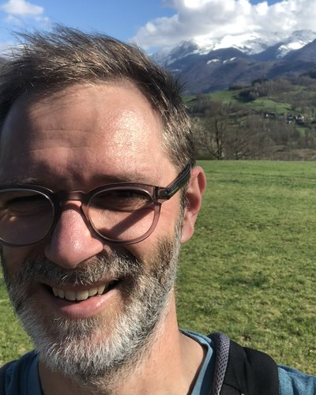
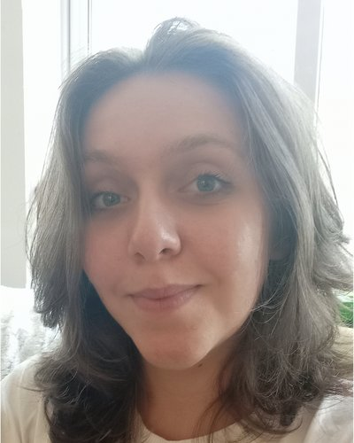
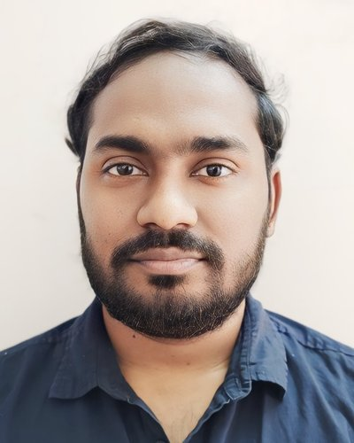
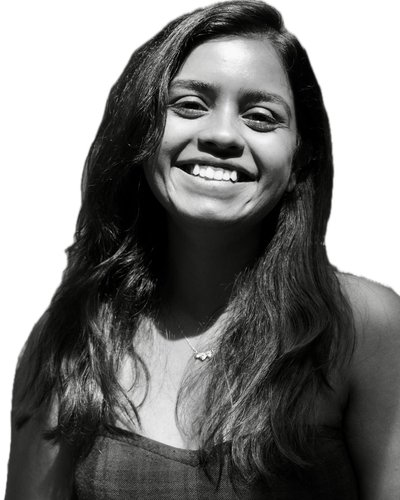
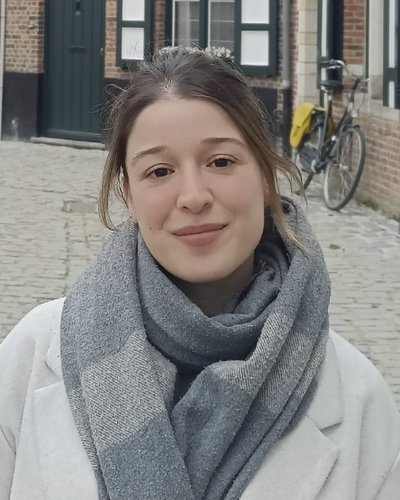
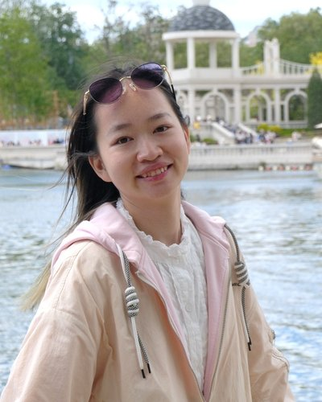
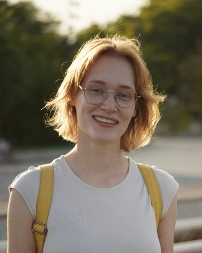

:::: {.person}
{fig-alt="Frederik De Laender"}

::: {.person-text}
**Frederik De Laender**

Frederik is interested in the various connections between environmental change, several aspects of biodiversity, and ecosystem function. He has led the lab since 2013 as a Professor at the University of Namur.
:::
::::

:::: {.person}
{fig-alt="Laura Willam"}

::: {.person-text}
**Laura Willam**

Nowadays, ecosystems are subject to an increasing variety of environmental stresses, which can result in biodiversity loss. However, biodiversity plays a key role in maintaining ecosystem functions, known as the 'biodiversity insurance effect'. Nevertheless, few studies have examined the impact of diverse environmental stresses on this effect. Laura's project therefore examines the combined effects of environmental stresses and biodiversity on algal communities using an experimental and modelling approach.
:::
::::

:::: {.person}
{fig-alt="Bidesh Bera"}

::: {.person-text}
**Bidesh Bera**

Bidesh investigates how environmental change influences species coexistence in ecological communities, focusing mainly on two environmental drivers: temperature and pollutants. By integrating species responses to these drivers into disordered systems theory, the project aims to clarify and predict how environmental change shapes community structure and dynamics.
:::
::::

:::: {.person}
{fig-alt="Arunima Sikder"}

::: {.person-text}
**Arunima Sikder**

Understanding how species respond and adapt to changing environments is becoming increasingly important in the face of rapid global change. Arunima's PhD thesis is centered around acclimation theory and its role in the impact of environmental stress on populations and their recovery from it, using globally relevant phytoplankton communities. The thesis addresses the prevalent knowledge gap on growth and trait dynamics in acclimated populations and communities exposed to environmental fluctuations. The ubiquitous distribution of the focal species ensures that the results will be transferable to other organismal systems across geographical boundaries.
:::
::::

:::: {.person}
{fig-alt="Maria Druet"}

::: {.person-text}
**Maria Druet**

Maria's PhD project investigates how soil saprotrophic fungi respond to heatwaves. The work focuses on fungal growth, functional traits, and interactions with bacteria in laboratory experiments. The aim is to improve our understanding of fungal ecology under climate change.
:::
::::

:::: {.person}
::: {.person-placeholder}
GA
:::

::: {.person-text}
**Germain Agazzi**

Germain is a PhD student studying community assembly, that is, how species are gained or lost in an ecosystem over time. This research focuses on the different assembly pathways and the transient states that communities can pass through before reaching a final configuration. The project mainly uses computer models, alongside experimental work on algal communities.
:::
::::

:::: {.person}
{fig-alt="Dongyi Chen"}

::: {.person-text}
**Dongyi Chen**

Dongyi's research focuses on zooplankton–microbiome interactions and the ecological processes shaping microbial community assembly. By combining field surveys, controlled experiments, and microbial community sequencing, Dongyi aims to understand how these host–microbe associations vary across species and environments, and how they contribute to broader ecosystem processes.
:::
::::

:::: {.person}
{fig-alt="Marie Holthaus"}

::: {.person-text}
**Marie Holthaus**

Marie is an environmental systems scientist who uses computational ecological models to simulate and analyze the complex dynamics of ecosystems. Marie's PhD project focuses on modelling carbon cycling and microbial interactions in forest soil ecosystems, and investigates how these processes respond to shifts in tree species composition and environmental conditions.
:::
::::

:::: {.person}
::: {.person-placeholder}
EL
:::

::: {.person-text}
**Estelle Lechat**
:::
::::

:::: {.person}
::: {.person-placeholder}
AO
:::

::: {.person-text}
**Alexis Orban**
:::
::::

:::: {.person}
::: {.person-placeholder}
SE
:::

::: {.person-text}
**Sophie Eischen**
:::
::::

:::: {.person}
::: {.person-placeholder}
RN
:::

::: {.person-text}
**Ruth Nies**
:::
::::
